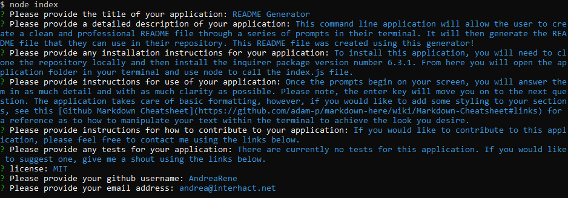

# README Generator

## Description
  
This command line application will allow the user to create a clean and professional README file through a series of prompts in their terminal. It will then generate the README file that they can use in their repository. This README file was created using this generator!

You can view the step by step video [here](https://drive.google.com/file/d/1aPTcs2zxkWzbs2LsGI4GfTGvzT3Chfom/view).

## Contents
  
- [Installation](#Installation)
- [Usage](#Usage)
- [Contributing](#Contributing)
- [Tests](#Tests)
- [License](#License)
- [Questions](#Questions)
  
## Installation
  
To install this application, you will need to clone the repository locally and then install the inquirer package version number 6.3.1. From here you will open the application folder in your terminal and use node to call the index.js file.
  
## Usage
  
Once the prompts begin on your screen, you will answer them in as much detail and with as much clarity as possible. Please note, the enter key will move you on to the next question. The application takes care of basic formatting, however, if you would like to add some styling to your sections, see this [Github Markdown Cheatsheet](https://github.com/adam-p/markdown-here/wiki/Markdown-Cheatsheet) for a reference as to how to manipulate your text within the terminal to achieve the look you desire. 

See the screenshot below for a visual of how the terminal should look once you have completed the prompts.

  
## Contributing
  
If you would like to contribute to this application, please feel free to contact me using the links below.
  
## Tests
  
There are currently no tests for this application. If you would like to suggest one, give me a shout using the links below.

## Questions

If you have any questions, feel free to reach out:

- [DonnieRoberts](https://github.com/Donnie46)
- [dnr.services88@gmail.com](mailto:dnr.services88@gmail.com?subject=[GitHub]%20README.md%20Generator%20Question)
